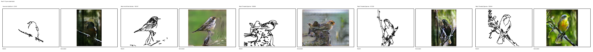
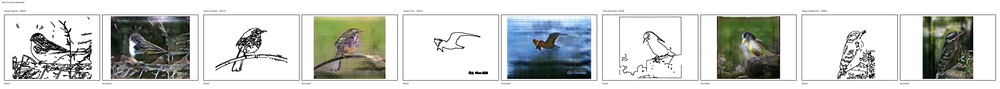
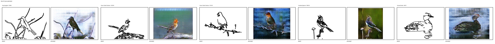
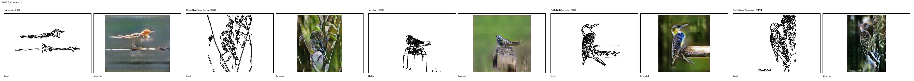
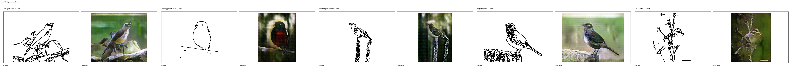
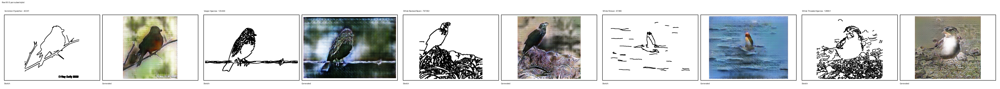
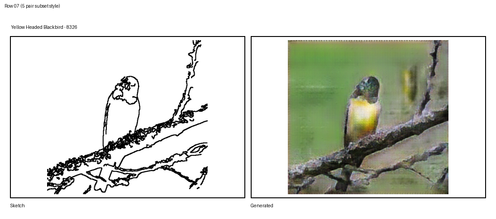
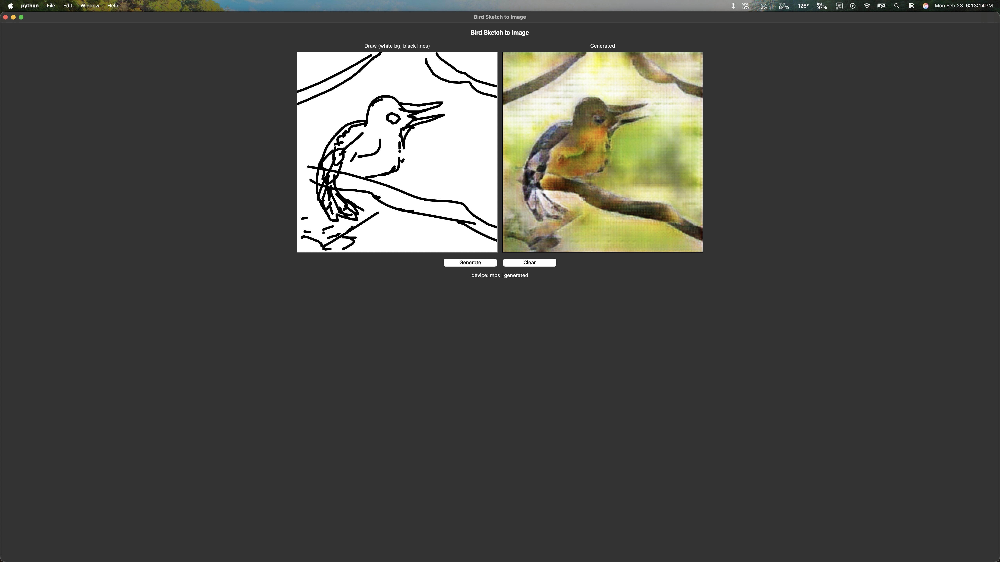
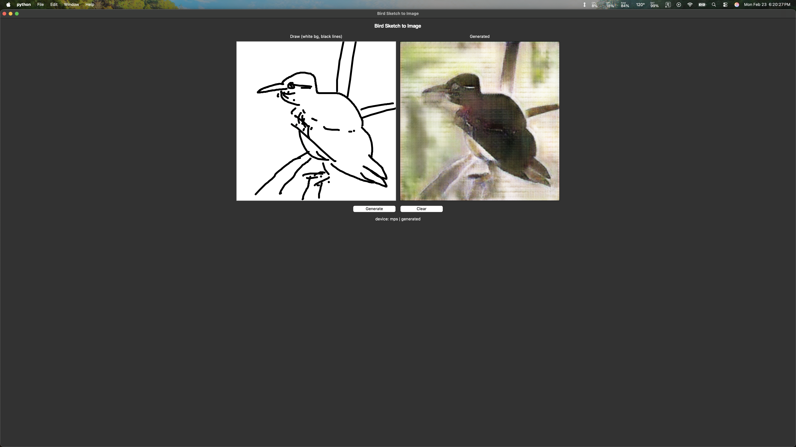
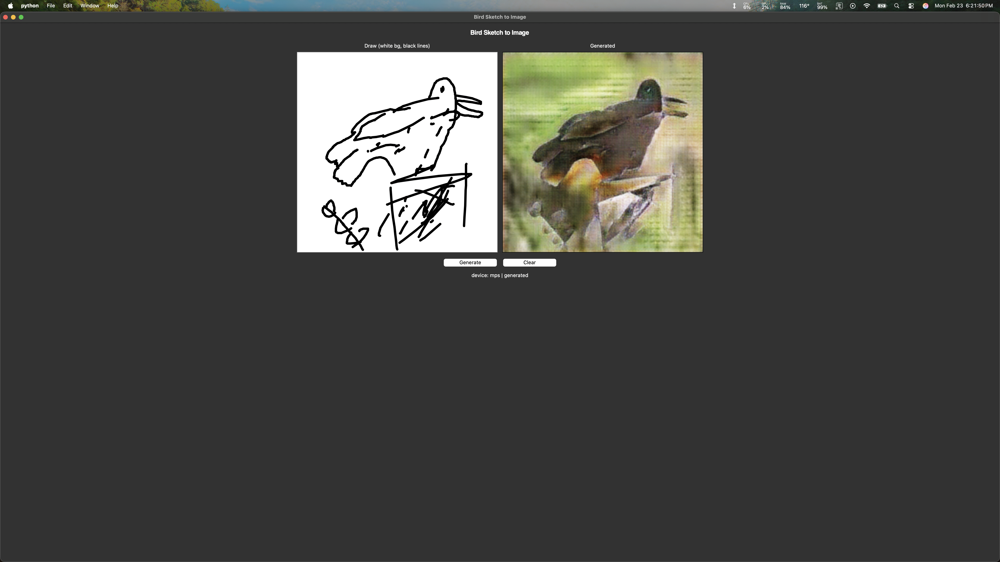

# Sketch2Bird

Sketch2Bird generates realistic bird images from simple line sketches using a pix2pix-style U-Net generator.

## How it works

1. Sketch input (manual drawing or edge-based sketch)
2. Resize to 256x256
3. Convert to RGB
4. Normalize to [-1, 1]
5. Forward pass through the generator
6. Convert output back to an RGB image

## Model

- Conditional image-to-image translation
- U-Net generator with encoder-decoder structure
- Skip connections
- Tanh output
- PyTorch

## Results

### Sample panels

### Animations

## Drawing interface

Screenshots:

